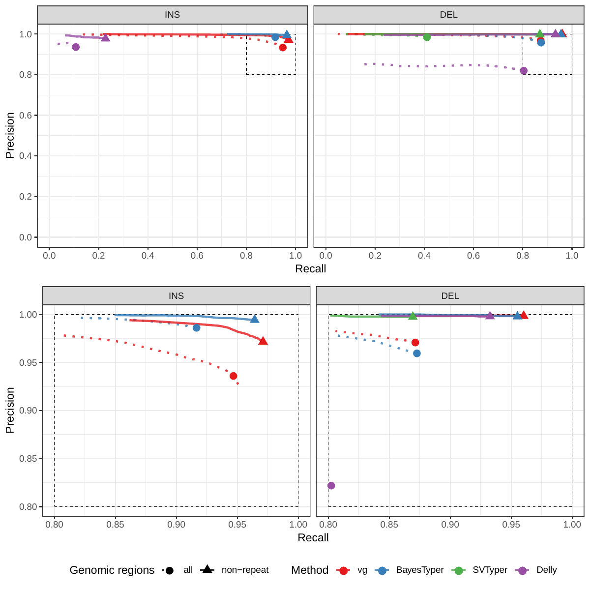
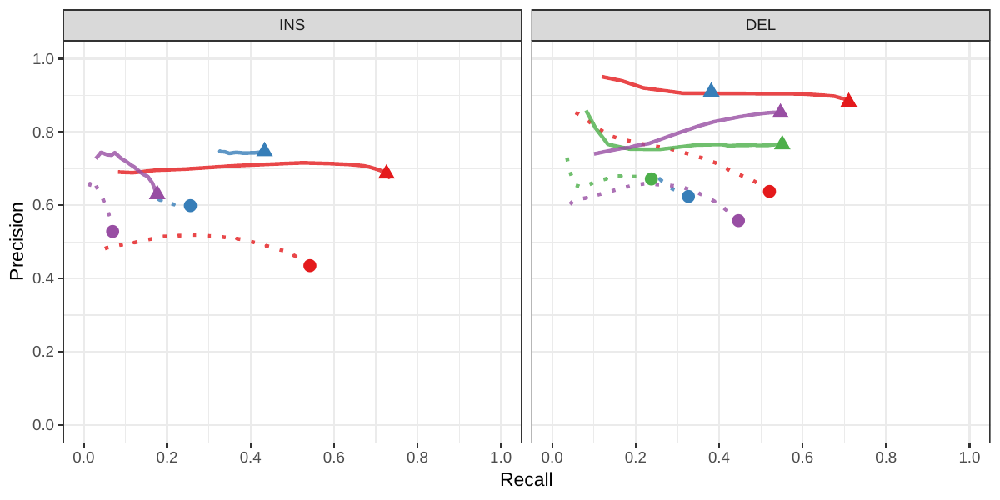

## Supplementary Material

| Experiment      | Method     | Type | Precision     | Recall        | F1            |
|:----------------|:-----------|:-----|:--------------|:--------------|:--------------|
| Simulated reads | vg         | INS  | 0.795 (0.885) | 0.796 (0.883) | 0.795 (0.884) |
|                 |            | DEL  | 0.869 (0.971) | 0.771 (0.92)  | 0.817 (0.945) |
|                 | BayesTyper | INS  | 0.91 (0.935)  | 0.835 (0.9)   | 0.871 (0.917) |
|                 |            | DEL  | 0.898 (0.981) | 0.806 (0.929) | 0.849 (0.954) |
|                 | svtyper    | DEL  | 0.809 (0.876) | 0.328 (0.754) | 0.467 (0.81)  |
|                 | Delly      | INS  | 0.767 (0.866) | 0.093 (0.225) | 0.166 (0.358) |
|                 |            | DEL  | 0.696 (0.903) | 0.707 (0.846) | 0.701 (0.874) |
| Real reads      | vg         | INS  | 0.431 (0.683) | 0.541 (0.726) | 0.48 (0.704)  |
|                 |            | DEL  | 0.65 (0.886)  | 0.519 (0.708) | 0.577 (0.787) |
|                 | BayesTyper | INS  | 0.601 (0.747) | 0.254 (0.433) | 0.357 (0.549) |
|                 |            | DEL  | 0.627 (0.91)  | 0.325 (0.381) | 0.428 (0.537) |
|                 | svtyper    | DEL  | 0.661 (0.733) | 0.236 (0.551) | 0.348 (0.629) |
|                 | Delly      | INS  | 0.516 (0.621) | 0.068 (0.176) | 0.12 (0.275)  |
|                 |            | DEL  | 0.55 (0.838)  | 0.445 (0.547) | 0.492 (0.662) |

Table: Genotyping evaluation on the HGSVC dataset. Precision, recall and F1 score for the call set with the best F1 score. The numbers in parenthesis corresponds to the results in non-repeat regions. {#tbl:hgsvc tag="S1"}

---

| Method     | Type | Precision     | Recall        | F1            |
|:-----------|:-----|:--------------|:--------------|:--------------|
| vg         | INS  | 0.658 (0.774) | 0.646 (0.735) | 0.652 (0.754) |
|            | DEL  | 0.68 (0.768)  | 0.643 (0.735) | 0.661 (0.751) |
| BayesTyper | INS  | 0.776 (0.879) | 0.286 (0.379) | 0.418 (0.53)  |
|            | DEL  | 0.808 (0.886) | 0.512 (0.696) | 0.627 (0.779) |
| svtyper    | DEL  | 0.742 (0.818) | 0.342 (0.496) | 0.468 (0.618) |
| Delly      | INS  | 0.822 (0.894) | 0.177 (0.268) | 0.291 (0.412) |
|            | DEL  | 0.722 (0.822) | 0.645 (0.768) | 0.681 (0.794) |

Table: Genotyping evaluation on the Genome in a Bottle dataset. Precision, recall and F1 score for the call set with the best F1 score. The numbers in parenthesis corresponds to the results in non-repeat regions. {#tbl:giab tag="S2"}

---

| Method   | Region     | Type | Precision | Recall |    F1 |
|:---------|:-----------|:-----|----------:|-------:|------:|
| vg       | all        | INS  |     0.665 |  0.661 | 0.663 |
|          |            | DEL  |     0.688 |  0.500 | 0.579 |
|          | non-repeat | INS  |     0.806 |  0.784 | 0.795 |
|          |            | DEL  |     0.869 |  0.762 | 0.812 |
| SMRT-SV2 | all        | INS  |     0.757 |  0.536 | 0.628 |
|          |            | DEL  |     0.848 |  0.630 | 0.723 |
|          | non-repeat | INS  |     0.880 |  0.680 | 0.767 |
|          |            | DEL  |     0.971 |  0.824 | 0.891 |

Table: Genotyping evaluation on the pseudo-diploid genome built from CHM cell lines in Audano et al.[@tag:audano2019]. {#tbl:chmpd tag="S3"}

---

| Method   | Region     | Type |    TP |    FP |    FN | Precision | Recall |    F1 |
|:---------|:-----------|:-----|------:|------:|------:|----------:|-------:|------:|
| vg       | all        | INS  | 25838 | 22042 | 15772 |     0.540 |  0.621 | 0.577 |
|          |            | DEL  | 14545 |  6824 | 15425 |     0.681 |  0.485 | 0.567 |
|          |            | INV  |    27 |    26 |   173 |     0.509 |  0.135 | 0.213 |
|          | non-repeat | INS  |  8051 |  3258 |  1817 |     0.712 |  0.816 | 0.760 |
|          |            | DEL  |  3769 |   623 |   818 |     0.858 |  0.822 | 0.840 |
|          |            | INV  |    19 |    12 |    75 |     0.613 |  0.202 | 0.304 |
| SMRT-SV2 | all        | INS  | 16270 | 26031 | 25340 |     0.385 |  0.391 | 0.388 |
|          |            | DEL  | 11793 | 10106 | 18177 |     0.539 |  0.393 | 0.455 |
|          | non-repeat | INS  |  4483 |  4659 |  5385 |     0.490 |  0.454 | 0.472 |
|          |            | DEL  |  2928 |   930 |  1659 |     0.759 |  0.638 | 0.693 |

Table: Calling evaluation on the SVPOP dataset. Combined results for the HG5014, HG00733 and NA19240 individuals, 3 of the 15 individuals used to generate the high-quality SV catalog in Audano et al.[@tag:audano2019]. {#tbl:svpop tag="S4"}

---

| SV type | Error type   | Breakpoint | Variant | Proportion | Mean size (bp) | Mean error (bp) |
|:--------|:-------------|:-----------|--------:|-----------:|---------------:|----------------:|
| DEL     | one end      | incorrect  |     220 |      0.219 |        422.655 |           6.095 |
|         |              | fine-tuned |     784 |      0.781 |        670.518 |           5.430 |
|         | both ends    | incorrect  |     811 |      0.814 |        826.070 |           6.275 |
|         |              | fine-tuned |     185 |      0.186 |        586.676 |           2.232 |
| INS     | location/seq | incorrect  |     123 |      0.062 |        428.724 |           6.667 |
|         |              | fine-tuned |    1877 |      0.938 |        440.043 |           6.439 |
| INV     | one end      | incorrect  |     868 |      0.835 |        762.673 |           5.161 |
|         |              | fine-tuned |     172 |      0.165 |        130.244 |           5.884 |
|         | both ends    | incorrect  |     950 |      0.992 |        556.274 |           5.624 |
|         |              | fine-tuned |       8 |      0.008 |        200.000 |           1.375 |

Table: Breakpoint fine-tuning using augmentation through "vg call". 
For deletions and inversions, either one or both breakpoints were shifted to introduce errors in the input VCF. 
For insertions, the insertion location and sequence contained errors.
{#tbl:simerror-bkpt tag="S5"}

---

{#fig:hgsvc-sim-geno tag="S1"}

{#fig:hgsvc-sim tag="S2"}

{#fig:hgsvc-real-geno tag="S3"}

{#fig:hgsvc-real tag="S4"}

{#fig:giab-geno tag="S5"}

{#fig:giab tag="S6"}

{#fig:chmpd-geno tag="S7"}

{#fig:chmpd tag="S10"}

{#fig:svpop tag="S11"}

{#fig:simerror-bkpt tag="S12"}

{#fig:yeast-mapping-four tag="S13"}

{#fig:geno-comp-score tag="S14"}
